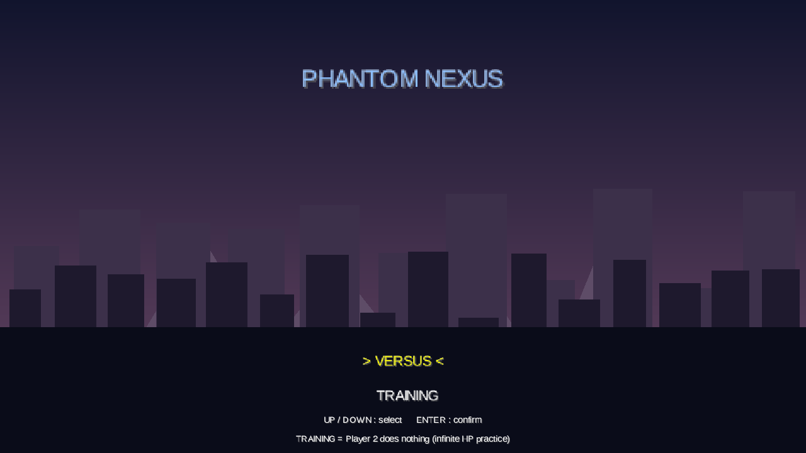
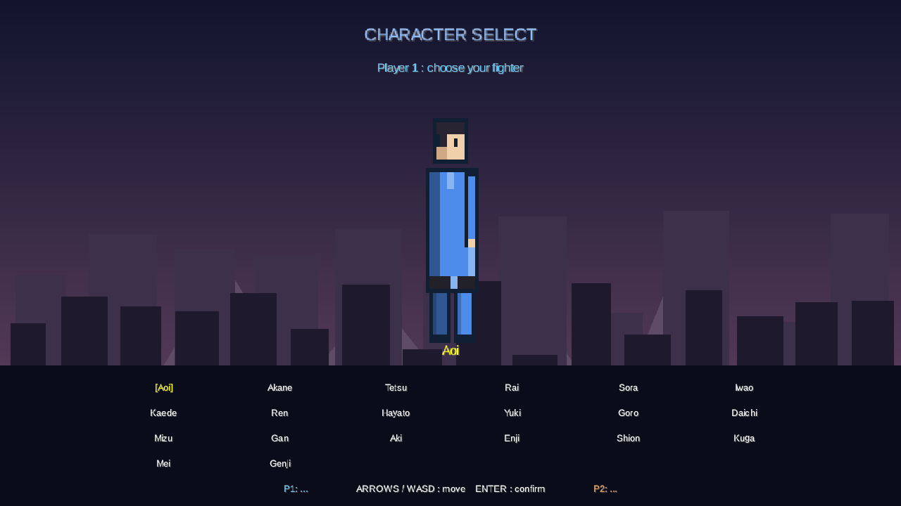
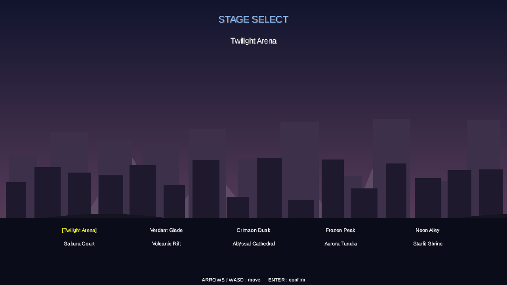
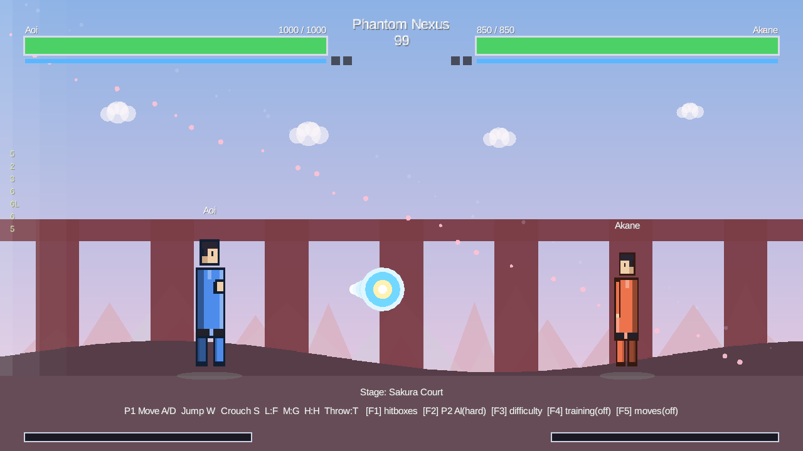
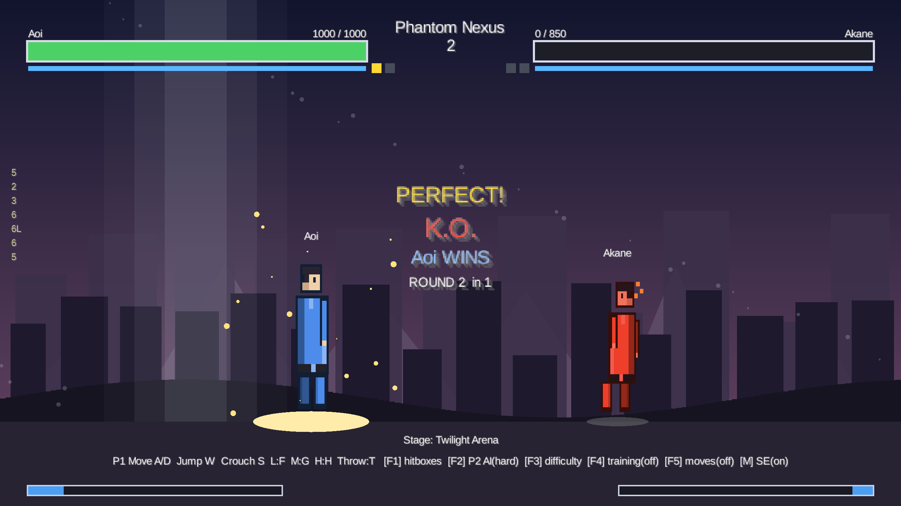
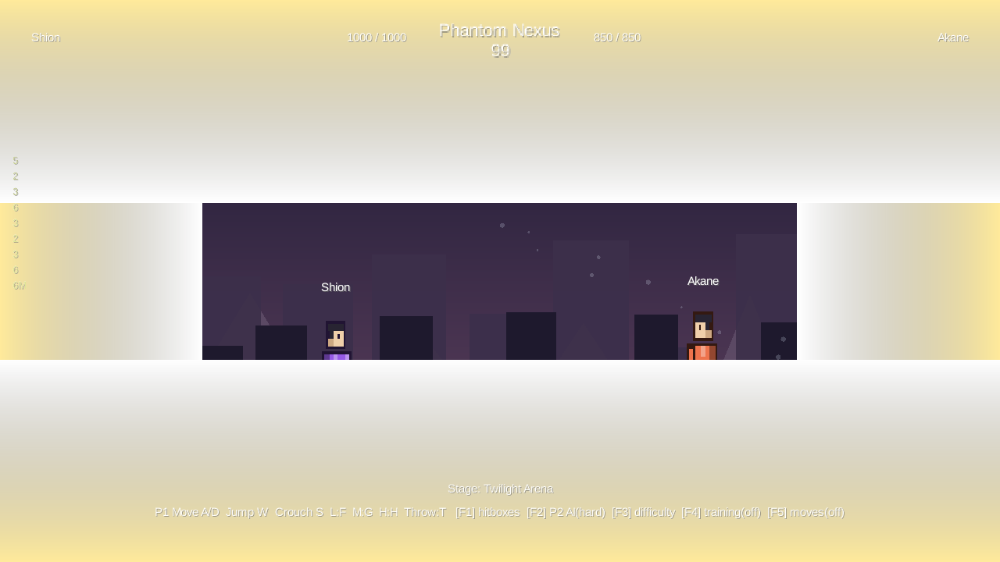

# Phantom Nexus

**キャラ・技・ステージ・AI を JSON で追加できる、拡張性重視の 2D 格闘ゲームエンジン**。固定キャラ制ではなく、MUGEN のように「ユーザーが独自キャラを足せる」格闘ゲーム基盤を目指す。

- **技術**：Java / LibGDX / Gradle（データ形式は JSON＝LibGDX 組込み）
- **対象**：Windows PC（将来 Linux / macOS）
- **開発運用**：実装は Claude Code、レビューは Codex（GitHub App）＋ CodeRabbit ＋ Claude（CI / fresh context）の 3 系統
- 開発指針は [CLAUDE.md](CLAUDE.md)、Codex 向け指示は [AGENTS.md](AGENTS.md) を参照

---

## スクリーンショット

`./gradlew run` で **タイトル → モード選択 →（対戦なら）キャラクター選択 → ステージ選択 → バトル** と進む。決着後は結果画面で **`ENTER`/`SPACE`/`J`/`ESC`** を押すとタイトルへ戻れる。

| タイトル（デモリール背景） | キャラクター選択（立ち絵プレビュー） |
|---|---|
|  |  |
| 全 10 ステージの実背景を巡回＋ **VERSUS / TRAINING** 選択 | 全 10 キャラからスプライト立ち絵を見ながら P1 / P2 を選択 |

| ステージ選択（実背景ライブプレビュー） | 対戦画面（モダンな見た目） |
|---|---|
|  |  |
| 全 10 ステージの多層背景をライブプレビュー＝カーソルで切替 | 多層パララックス背景＋情景アニメ＋エネルギー飛び道具・クリーン HUD |

| パーフェクト KO | スーパーフラッシュ |
|---|---|
|  |  |
| ノーダメージでラウンドを取ると金色 **PERFECT!** 演出 | スーパー必殺技発動で画面の縁が金色にフラッシュ |

> 各タスクの動作証跡（当たり判定・各機構の静止画）は [docs/screenshots/](docs/screenshots/) に 150 枚以上を収録。

---

## 主な特徴

### データ駆動（このプロジェクトの核）

キャラ・ステージ・技・当たり判定・AI 設定を **外部 JSON** で定義する。新キャラ追加は「JSON ＋ スプライト PNG の 2 ファイル」で完結し、**コードを変えずに**コンボ・必殺技ゲージ・ダウン等の既存戦闘機構をそのまま使える。データ I/O の唯一の真実は `Shared/`。

- 収録：**10 キャラ・10 ステージ**（いずれも JSON だけで追加・差し替え可能）

### 戦闘システム

- **技**：通常技（弱/中/強）・必殺技（波動拳/無敵対空 等）・EX 必殺技・スーパー必殺技
- **防御**：立ち/しゃがみ/空中ガード・ジャストガード・パリィ・プッシュブロック・ガードゲージ／ガードクラッシュ
- **崩し**：投げ（ガード不能）／投げ抜け・コマンド投げ・ダウン／受け身（＝打撃・ガード・投げの三すくみ）
- **コンボ**：チェーンコンボ・特殊キャンセル・ダメージ補正・浮かせ／ジャグル・壁/床バウンド
- **機動**：ダッシュ／バックステップ・ラン・二段ジャンプ・空中ダッシュ・空中投げ
- **その他**：カウンターヒット・多段ヒット・めまい・スーパーアーマー・ヒットストップ・OTG・回復可能ダメージ

### AI

相手の状態と距離だけで判断する**読み合い反応**（乱数なし＝決定的）。打撃にはガード、ガード偏重は投げ、投げは投げ抜け…と三すくみで応じ、無敵対空・飛び込み・飛び道具牽制まで行う。難易度 **EASY / NORMAL / HARD**（F3 で切替）で反応を段階解放。

### 演出・UI・モード

- 多層パララックス背景＋情景アニメ（雲/雪/花びら/火の粉）・前景レイヤー
- 多数の純描画演出（影・砂煙・ヒットスパーク・各種フラッシュ・オーラ・画面振動 等／すべて決定的＝リプレイ不変）
- サウンドエフェクト（`M` キーでミュート）
- モード：対戦 / トレーニング（F4・HP 無限のダミー）、デバッグ当たり判定表示（F1）、コマンド表（F5）

### 開発ツール

- **入力リプレイ**：毎フレームの入力だけを記録し、決定的シミュで同じ試合を完全再現（ゲーム状態の保存不要）
- **ヘッドレス自動スクショ**：CI / Claude Code on the web で動作証跡を PNG 撮影

詳しい戦闘仕様は [docs/BattleSystem.md](docs/BattleSystem.md)、データ形式は [docs/DataFormat.md](docs/DataFormat.md) を参照。

---

## ビルドと実行

```sh
./gradlew build      # 完了基準（コンパイル + テスト）
./gradlew test       # テストのみ
./gradlew run        # デスクトップ（LWJGL3）で起動
```

JDK は Gradle toolchain で Java 17 を自動取得する（要ネットワーク）。Windows は `gradlew.bat` でも可。macOS では `run` タスクが LWJGL3/GLFW のために `-XstartOnFirstThread` を自動付与するので、追加設定なしで `./gradlew run` が起動する。

---

## 操作方法

### 基本操作（キー割当）

| 操作 | P1 | P2（人間時） |
|---|---|---|
| 移動 | A / D | ← / → |
| ジャンプ | W | ↑ |
| しゃがみ | S | ↓ |
| 弱攻撃（light） | F | Numpad 1 |
| 中攻撃（medium） | G | Numpad 2 |
| 強攻撃（heavy） | H | Numpad 3 |
| 投げ（throw） | T | Numpad 0 |

### 応用操作（入力の組み合わせ・派生アクション）

| 操作 | 入力方法 |
|---|---|
| 必殺技（波動拳） | しゃがみ → 前 + 攻撃（236 + 任意攻撃ボタン） |
| ダッシュ | 同じ方向を素早く二度押し（前ステップ／バックステップ） |
| 空中攻撃（飛び込み） | ジャンプ中に攻撃ボタン（弱/中/強） |
| しゃがみ攻撃（下段） | しゃがみ中に攻撃ボタン（立ちガード不可） |
| 立ちガード | 相手と逆方向（後退方向）を保持（chip のみ・のけぞりなし） |
| しゃがみガード | しゃがみ中に後退方向を保持（下段を防ぐ） |
| 空中ガード | ジャンプ中に後退方向を保持（飛び道具・中段/上段を chip で凌ぐ） |
| 投げ抜け | 掴まれる瞬間に投げボタンを押す（ノーダメージで相互に弾かれる） |

※ 投げは立ち/しゃがみどちらのガードでも防げない **ガード不能**（ジャンプで回避可）。連続ガードでガードゲージが尽きると **ガードクラッシュ**（ガード不能の隙）。

### システムキー（トグル）

| キー | 機能 |
|---|---|
| F1 | デバッグ当たり判定表示の ON/OFF（push=青 / hurt=緑 / hit=赤） |
| F2 | P2 の AI ⇄ 人間 切替（既定は P2=AI） |
| F3 | AI 難易度の循環（EASY → NORMAL → HARD） |
| F4 | トレーニングモード（HP 無限のダミーでコンボ練習） |
| F5 | コマンド表 HUD（技/コマンド一覧）の表示切替 |
| M | サウンドエフェクトのミュート切替 |

※ 勝敗：制限時間内に相手の HP を 0 にすれば KO。時間切れは HP 残量が多い側の勝ち。

---

## フォルダ構成（第一設計書準拠 — 変更禁止）

```
GameRuntime/   Core / Rendering / Input / Battle / Debug / Audio … ゲーム本体（Java ソース）
Assets/        Characters / Stages / Sounds / Effects            … 実行時リソース（外部キャラ JSON 等）
Shared/        Schema / Types / Constants                        … ★データ I/O の唯一の真実★
Tools/         CharacterViewer / HitboxEditor                    … 開発補助（将来）
Infra/Build/                                                     … Gradle ビルドロジックの実体
docs/          DataFormat.md / BattleSystem.md / screenshots
```

> Gradle ラッパー（`gradlew*`）と最小シム（root の `settings.gradle` / `build.gradle`）のみ root に置き、実体は `Infra/Build/` に委譲する（[CLAUDE.md](CLAUDE.md) 参照）。

---

## 進捗

設計書タスク **1〜173 をすべて完了**。1 タスク = 1 ブランチ `task/<N>-<短い名>` = 1 PR、完了基準は `./gradlew build` 成功。MVP（2 体表示・移動/ジャンプ/攻撃・HP・判定・1 ラウンド勝敗・JSON 読込・ステージ・デバッグ表示）は Task 18 + 22 で達成済み。

<details>
<summary>タスク一覧（全 173 ＋ 追加機能）を開く</summary>

| # | タスク | 状態 |
|---|---|---|
| 1 | リポジトリ作成 / Bootstrap（テンプレ適用・docs 骨格） | ✅ 完了 |
| 2 | Gradle プロジェクト作成 | ✅ 完了 |
| 3 | LibGDX 初期画面作成 | ✅ 完了 |
| 4 | ウィンドウ表示 | ✅ 完了 |
| 5 | 入力処理作成 | ✅ 完了 |
| 6 | キャラクター描画 | ✅ 完了 |
| 7 | キャラクター移動 | ✅ 完了 |
| 8 | ジャンプ処理 | ✅ 完了 |
| 9 | アニメーション管理 | ✅ 完了 |
| 10 | HP ゲージ表示 | ✅ 完了 |
| 11 | 攻撃処理 | ✅ 完了 |
| 12 | 当たり判定処理 | ✅ 完了 |
| 13 | ダメージ処理 | ✅ 完了 |
| 14 | ラウンド勝敗判定 | ✅ 完了 |
| 15 | キャラクター JSON 定義 | ✅ 完了 |
| 16 | キャラクター JSON 読み込み | ✅ 完了 |
| 17 | ステージ表示 | ✅ 完了 |
| 18 | デバッグ当たり判定表示 | ✅ 完了 |
| — | **MVP ゲート（設計書 MVP 9 条件を充足）** | — |
| 19 | コマンド入力 | ✅ 完了 |
| 20 | 必殺技ステート | ✅ 完了 |
| 21 | 簡易 AI | ✅ 完了 |
| 22 | キャラクター追加検証 | ✅ 完了 |
| 23 | ドキュメント整備 | ✅ 完了 |
| 24 | 複数技の JSON 化（弱/中/強 + 複数必殺技） | ✅ 完了 |
| 25 | しゃがみ（Crouch） | ✅ 完了 |
| 26 | 複数ラウンド制（ベスト・オブ 3） | ✅ 完了 |
| 27 | ガード（立ちガード・chip ダメージ） | ✅ 完了 |
| 28 | しゃがみ攻撃（低姿勢を維持したまま攻撃） | ✅ 完了 |
| 29 | しゃがみ移動（低速クロール） | ✅ 完了 |
| 30 | しゃがみガード（しゃがみ後退で低姿勢ガード） | ✅ 完了 |
| 31 | 下段判定（しゃがみ攻撃を下段技化・立ちガード不可） | ✅ 完了 |
| 32 | 空中攻撃（滞空中に通常技を発動） | ✅ 完了 |
| 33 | ガード高さ属性（overhead/mid/low をデータ化・上段は立ちガード必須） | ✅ 完了 |
| 34 | スプライト描画（キャラ画像をテクスチャ表示・状態/フレーム同期・矩形フォールバック） | ✅ 完了 |
| 35 | 投げ技（ガード不能の近接掴み・ジャンプで回避可） | ✅ 完了 |
| 36 | 投げ抜け（throw tech・投げ返しで掴みを相互に弾く） | ✅ 完了 |
| 37 | AI 拡張（攻撃に反応してガード・ガード偏重を投げで崩す） | ✅ 完了 |
| 38 | ヒットスパーク（命中位置に火花エフェクトを出す手応え演出） | ✅ 完了 |
| 39 | コンボカウンター（連続ヒット数を "N HITS!" で表示） | ✅ 完了 |
| 40 | 第2ステージ追加（stage002・JSON のみで背景差し替え検証） | ✅ 完了 |
| 41 | 3 体目キャラ追加（fighter003 Tetsu・JSON のみでキャラ追加検証） | ✅ 完了 |
| 42 | ラウンド開始イントロ演出（"ROUND N" → "FIGHT!" ＋ 開始前の入力ロック） | ✅ 完了 |
| 43 | ガードゲージ／ガードクラッシュ（連続ガードでゲージ枯渇→ガード不能の隙） | ✅ 完了 |
| 44 | 必殺技ゲージ／EX 必殺技（ゲージ満タンで強化版の飛び道具） | ✅ 完了 |
| 45 | チェーンコンボ（通常技キャンセル・弱→中→強で連続ヒット） | ✅ 完了 |
| 46 | コンボダメージ補正（連続ヒットが伸びるほど後続の与ダメージが減衰） | ✅ 完了 |
| 47 | 特殊キャンセル（通常技を必殺技でキャンセルしてコンボを繋ぐ） | ✅ 完了 |
| 48 | 4 体目キャラ追加（fighter004 Rai・高速ラッシュ型・JSON のみで追加） | ✅ 完了 |
| 49 | ダッシュ（二度押しで前ステップ／バックステップ） | ✅ 完了 |
| 50 | AI のダッシュ接近（遠距離は歩きでなくダッシュで素早く間合いを詰める） | ✅ 完了 |
| 51 | AI の投げ抜け反応（掴まれる瞬間に投げ抜けでノーダメージ・三すくみ完成） | ✅ 完了 |
| 52 | 5 体目キャラ追加（fighter005 Sora・遠距離 zoner 型・JSON のみで追加） | ✅ 完了 |
| 53 | 打撃必殺技／無敵リバーサル（昇龍拳タイプの無敵対空・`invincibleFrames` を JSON データ化） | ✅ 完了 |
| 54 | EX 打撃必殺技（メーター満タンで打撃必殺技を消費強化・ダメージ 1.6 倍＋金色演出） | ✅ 完了 |
| 55 | AI の無敵対空（飛び込みを無敵リバーサルで迎撃・AI が初めて必殺技を使う） | ✅ 完了 |
| 56 | AI 難易度（EASY/NORMAL/HARD・反応を段階解放） | ✅ 完了 |
| 57 | AI のジャンプ攻撃（飛び込み・前方ジャンプから空中攻撃を重ねる） | ✅ 完了 |
| 58 | 6 体目キャラ追加（fighter006 Iwao・飛び道具なしの純グラップラー型・JSON のみで追加） | ✅ 完了 |
| 59 | 空中ガード（滞空中に後退方向保持で飛び道具・中段/上段を chip ガード） | ✅ 完了 |
| 60 | ダウン（knockdown・特定技でダウンさせる・ダウン中無敵・JSON `knockdown` でデータ化） | ✅ 完了 |
| 61 | 7 体目キャラ追加（fighter007 Kaede・飛び道具＋ knockdown heavy・無敵リバーサルなしの footsies 型・JSON のみで追加） | ✅ 完了 |
| 62 | 2P パレットスワップ（ミラーマッチ＝同キャラ対戦で P2 を色変えして識別） | ✅ 完了 |
| 63 | AI の下段読みしゃがみガード（相手の下段にしゃがみガードで対応・HARD のみ） | ✅ 完了 |
| 64 | AI の飛び道具牽制（zoner・遠距離で飛び道具を撃って牽制・HARD のみ） | ✅ 完了 |
| 65 | ダッシュ攻撃（ダッシュ中の攻撃で出る突進打撃・JSON `dashAttack` でデータ化） | ✅ 完了 |
| 66 | 受け身（ukemi・ダウン直後の行動入力でクイック起き上がり・起き攻めへの対抗） | ✅ 完了 |
| 67 | 8 体目キャラ追加（fighter008 Ren・ダッシュ起き攻め rushdown 型・JSON のみで追加） | ✅ 完了 |
| 68 | 二段ジャンプ（空中での追加ジャンプ・JSON `airJumps` でデータ化） | ✅ 完了 |
| 69 | 空中ダッシュ（滞空中の方向二度押しで水平バースト・JSON `airDashes` でデータ化） | ✅ 完了 |
| 70 | 空中投げ（滞空中の相手専用のガード不能掴み・JSON `airThrowMove` でデータ化） | ✅ 完了 |
| 71 | カウンターヒット（相手の攻撃 startup 中に打撃を当てるとダメージ増＋のけぞり延長） | ✅ 完了 |
| 72 | 9 体目キャラ追加（fighter009 Hayato・高 HP の charge zoner 型・JSON のみで追加） | ✅ 完了 |
| 73 | 第3ステージ追加（stage003 Crimson Dusk・JSON のみで背景差し替え検証） | ✅ 完了 |
| 74 | 多段ヒット技（1 つの技が active 中に複数回ヒット・JSON `hits`/`hitGap` でデータ化） | ✅ 完了 |
| 75 | AI 受け身（HARD の AI がダウン直後にクイック起き上がりして起き攻めに対抗） | ✅ 完了 |
| 76 | 10 体目キャラ追加（fighter010 Yuki・多段ヒット rapid jab の高速 rushdown 型・JSON のみで追加） | ✅ 完了 |
| 77 | 第4ステージ追加（stage004 Frozen Peak・JSON のみで背景差し替え検証） | ✅ 完了 |
| 78 | 実行時 AI 難易度切替（F3 で EASY/NORMAL/HARD を循環・リプレイ中は無効） | ✅ 完了 |
| 79 | めまい（dizzy・スタン蓄積でフルコンボ確定の無防備硬直・JSON `stunThreshold` でデータ化） | ✅ 完了 |
| 80 | スーパーアーマー（startup 中にのけぞらず被弾を吸収・JSON `armorHits` でデータ化） | ✅ 完了 |
| 81 | ジャストガード（ヒット直前の反応ガードで chip なし完全防御＋メーター獲得） | ✅ 完了 |
| 82 | 削り KO 禁止（chip ダメージでは HP を 1 未満にしない・削り殺し防止） | ✅ 完了 |
| 83 | 浮かせ（launch・打ち上げて空中やられ＝ジャグル起点・JSON `launch` でデータ化） | ✅ 完了 |
| 84 | 11 体目キャラ追加（fighter011 Goro・アーマー技を持つ重量級ブルーザー型・JSON のみで追加） | ✅ 完了 |
| 85 | OTG（追い打ち・ダウン中の相手にも当たる技・JSON `otg` でデータ化） | ✅ 完了 |
| 86 | ヒットストップ（命中/ガード時に両者を数フレーム凍結する衝撃演出・決定的） | ✅ 完了 |
| 87 | 12 体目キャラ追加（fighter012 Daichi・浮かせ＋空中機動の juggle 型・JSON のみで追加） | ✅ 完了 |
| 88 | 受け身不能ダウン（hard knockdown・受け身でクイック起き上がりできない・JSON `hardKnockdown`） | ✅ 完了 |
| 89 | 第5ステージ追加（stage005 Neon Alley・JSON のみで背景差し替え検証） | ✅ 完了 |
| 90 | トレーニングモード（F4・HP 無限のダミー相手でコンボ練習・撮影は `-x training=true`） | ✅ 完了 |
| 91 | 13 体目キャラ追加（fighter013 Mizu・高低段の崩し footsies 型・JSON のみで追加） | ✅ 完了 |
| 92 | スタンゲージ HUD（めまい蓄積を可視化・`stunThreshold>0` のキャラのみ表示） | ✅ 完了 |
| 93 | 第6ステージ追加（stage006 Sakura Court・JSON のみで背景差し替え検証） | ✅ 完了 |
| 94 | 投げ抜け不能投げ（command throw・投げ抜けできない確定の掴み・JSON `noTech` でデータ化） | ✅ 完了 |
| 95 | 14 体目キャラ追加（fighter014 Gan・確定投げ＋アーマーのコマンド投げ grappler 型・JSON のみで追加） | ✅ 完了 |
| 96 | 入力表示 HUD（P1 の直近入力をテンキー表記で画面左に表示・トレ/観戦用） | ✅ 完了 |
| 97 | AI 起き上がりリバーサル（HARD の AI がダウンからの起き上がりに無敵技で切り返す） | ✅ 完了 |
| 98 | 第7ステージ追加（stage007 Volcanic Rift・JSON のみで背景差し替え検証） | ✅ 完了 |
| 99 | 15 体目キャラ追加（fighter015 Aki・多段/浮かせ/二系統必殺技の万能 shoto 型・JSON のみで追加） | ✅ 完了 |
| 100 | ドキュメント総整備（CLAUDE.md フェーズ更新・kaizen 反映・撮影オーバーライド `training` 追記） | ✅ 完了 |
| 101 | 壁バウンド（wall bounce・`Move.wallBounce` で相手を画面端で跳ね返らせて再び浮かせる＝画面端ジャグル延長） | ✅ 完了 |
| 102 | 床バウンド（ground bounce・`Move.groundBounce` で着地時に跳ね返らせて再び浮かせる＝ジャグル延長） | ✅ 完了 |
| 103 | 16 体目キャラ追加（fighter016 Enji・launch/床バウンド/壁バウンド/飛び道具を束ねた bounce-juggle 型・JSON のみで追加） | ✅ 完了 |
| 104 | 回復可能ダメージ（レッドライフ・ガード chip を赤ゲージ化し無被弾で白 HP へ回復・非ガード被弾で焼き切れ） | ✅ 完了 |
| 105 | パリィ（parry・前方タップの反応で打撃を完全に弾き反撃確定・ジャストガードの前方版） | ✅ 完了 |
| 106 | AI パリィ反応（HARD の AI が相手打撃の startup 終盤を読んでパリィ・壁にならないクールダウン制） | ✅ 完了 |
| 107 | 第8ステージ追加（stage008 Abyssal Cathedral・JSON のみで背景差し替え検証） | ✅ 完了 |
| 108 | スーパー必殺技（236236＋攻撃＋メーター満タン消費で発動・スーパーフラッシュ凍結演出・`Move.superMove`/`Command.SUPER`） | ✅ 完了 |
| 109 | 17 体目キャラ追加（fighter017 Shion・スーパー必殺技＝多段ビームを持つ正統派 shoto 型・JSON のみで追加） | ✅ 完了 |
| 110 | AI スーパー必殺技（HARD の AI がメーター満タン＋間合い内でスーパー必殺技を発動） | ✅ 完了 |
| 111 | プッシュブロック（ガード時に攻撃側も押し戻して間合いを作る＝固め対策） | ✅ 完了 |
| 112 | コマンド表 HUD（F5 で技/コマンド一覧を表示・トレ/観戦用・`-x movelist=true`） | ✅ 完了 |
| 113 | 第9ステージ追加（stage009 Aurora Tundra・JSON のみで背景差し替え検証） | ✅ 完了 |
| 114 | 18 体目キャラ追加（fighter018 Kuga・アーマー＋壁バウンド＋スーパーの重量級 bruiser 型・JSON のみで追加） | ✅ 完了 |
| 115 | KO スローモーション演出（決着の一撃をスロー再生してからラウンド確定・決定的） | ✅ 完了 |
| 116 | スタート画面（タイトルでモード選択：対戦／トレーニング＝P2 が何もしない・通常起動はタイトルから） | ✅ 完了 |
| 117 | キャラクター選択画面（対戦選択時に遷移・全キャラから P1/P2 を選択してバトル開始） | ✅ 完了 |
| 118 | 19 体目キャラ追加（fighter019 Mei・機動力特化の高速 rushdown 型・JSON＋ロスター登録） | ✅ 完了 |
| 119 | 第10ステージ追加（stage010 Starlit Shrine・JSON のみで背景差し替え検証・計 10 ステージ） | ✅ 完了 |
| 120 | 20 体目キャラ追加（fighter020 Genji・全ツール装備の万能 shoto 型・ロスター計 20 体到達） | ✅ 完了 |
| 121 | コンボ累計ダメージ HUD（コンボ中の合計ダメージを `N HITS!` の下に表示） | ✅ 完了 |
| 122 | ディレイ起き上がり（ダウン中に下押しで起き上がりを遅らせる＝起き攻めのタイミングずらし） | ✅ 完了 |
| 123 | ラン（`Character.canRun`・前ダッシュ後に前方保持で走り続ける・機動型キャラの差別化） | ✅ 完了 |
| 124 | AI 端攻め（HARD の AI が画面端に追い詰めた相手へ proactive な投げ択を仕掛ける） | ✅ 完了 |
| 125 | ドキュメント総整備（CLAUDE.md フェーズ更新＝Task 101〜124 反映・撮影オーバーライド `startscreen`/`movelist` 追記・kaizen 反映） | ✅ 完了 |
| 126 | 空中受け身（air recovery・空中やられ中の行動入力で受け身して脱出・最小窓後のみ・受け身狩り可） | ✅ 完了 |
| 127 | パーフェクト KO 演出（PERFECT・勝者がノーダメージでラウンドを取ると金色で "PERFECT!" 表示） | ✅ 完了 |
| 128 | ステージ選択画面（対戦でキャラ確定後に全 10 ステージから対戦の背景を選択・タイトル→キャラ→ステージ→バトル） | ✅ 完了 |
| 129 | スプライト刷新（レトロ・ドット絵調・顔/髪/道着/帯/関節のある人型＋状態別ポーズ＋4コマのモーション差・全 20 体を再生成・JSON/コード変更なしの純アセット差し替え） | ✅ 完了 |
| 130 | 足元の影（ground shadow・床に落とす半透明の楕円・滞空高さで縮小／減光・純描画演出でデータ/戦闘ロジック非干渉） | ✅ 完了 |
| 131 | 着地の砂煙（landing dust・ジャンプ/浮かせからの着地で足元に土埃・滞空→接地の遷移を検出・HitSpark と同じ Battle POJO ＋ Core リスト ＋ Renderer 描画・決定的） | ✅ 完了 |
| 132 | 画面の微振動（hit shake・打撃/飛び道具/投げの接触でカメラをわずかに揺らす衝撃演出・決定的＝乱数なし・戦闘ロジック非干渉） | ✅ 完了 |
| 133 | ダッシュ残像（motion trail・ダッシュ中の直近位置にスプライトの寒色ゴーストを重ねる移動演出・決定的＝乱数なし・戦闘ロジック非干渉） | ✅ 完了 |
| 134 | 飛び道具の軌跡（projectile trail・弾の直近の通過位置に薄く小さい尾を引く速度感演出・決定的＝乱数なし・戦闘ロジック非干渉） | ✅ 完了 |
| 135 | ジャンプ踏み切りの砂煙（takeoff dust・接地→滞空の遷移で蹴り上げた足元に土埃・着地の砂煙 Task 131 と対称・LandingDust を流用・決定的） | ✅ 完了 |
| 136 | クリーンヒットの白フラッシュ（impact flash・打撃/投げ/ダウンの被弾直後に被弾側を数フレーム発光させる手応え演出・スプライトは加算合成でシルエット発光/矩形は白上重ね・決定的） | ✅ 完了 |
| 137 | 必殺技ゲージ満タンのオーラ（meter-full aura・ゲージ満タン＝EX/スーパー可のキャラの足元に金色のパルス光輪を出す発動可能インジケータ・純描画演出で決定的） | ✅ 完了 |
| 138 | ラウンド開始のズームイン演出（round intro zoom・"ROUND N"/"FIGHT!" 中にカメラを寄せ開始で等倍へズームアウト・純描画演出で決定的・撮影は -x intro=true でのみ表示） | ✅ 完了 |
| 139 | 背景の浮遊パーティクル（ambient motes・空にゆっくり漂う微かな光の粒で空気感を出す純描画演出・全ステージ共通・決定的） | ✅ 完了 |
| 140 | ダッシュ開始の砂煙（dash dust・地上ダッシュ開始時に足元へ土埃・着地/踏み切り砂煙と同じ LandingDust を流用・決定的） | ✅ 完了 |
| 141 | 残り時間警告の点滅（low time warning・残り時間が少ないとタイマーを赤く拡大して脈動させる純描画演出・決定的） | ✅ 完了 |
| 142 | ダメージポップアップのダメージ比例拡大（与ダメージが大きいほど数字を大きく表示・重みの可視化・純描画演出で決定的） | ✅ 完了 |
| 143 | コンボカウンターの拡大パルス（連続ヒット中の "N HITS!" を小刻みに拡大脈動させて勢いを出す純描画演出・決定的） | ✅ 完了 |
| 144 | 飛び道具発射のマズルフラッシュ（弾の生成位置に火花を出して発射の手応えを足す・HitSpark を流用・決定的） | ✅ 完了 |
| 145 | 低HP 警告ビネット（low-HP vignette・どちらかの HP が低いと画面端を赤く脈動させる純描画演出・決定的） | ✅ 完了 |
| 146 | HP バーのダメージトレイル（被弾で減った分を明るい遅延バーで一瞬残しダメージ量を伝える純描画演出・決定的） | ✅ 完了 |
| 147 | 空の光の帯（sky sweep・背景をゆっくり横切る淡い光の縦帯で空気感を出す純描画演出・決定的） | ✅ 完了 |
| 148 | KO 白フラッシュ（KO 決着の瞬間に画面の縁を白く光らせて余韻を作る純描画演出・縁グラデーションで決定的） | ✅ 完了 |
| 149 | 勝者グロー（決着/ラウンド間に勝者の足元へ金色のパルス光輪を出して際立たせる純描画演出・決定的） | ✅ 完了 |
| 150 | 勝利の光の粒（victory sparkles・決着時に勝者の周囲を金色の光の粒が舞い上がる祝祭演出・決定的） | ✅ 完了 |
| 151 | ステージ背景レイヤーシステム（SF6/スマブラ参考・JSON の `layers` で遠景/中景/近景の多層シルエット＝都市/山/丘/柱を奥行き描画・stage001 を都市夜景に再設計・決定的・後方互換） | ✅ 完了 |
| 152 | 自然系 3 ステージのレイヤー再設計（stage002 Verdant Glade=多層の森／stage003 Crimson Dusk=夕暮れの山脈／stage004 Frozen Peak=雪山・JSON のみ・後方互換） | ✅ 完了 |
| 153 | 都市/和風/火山 3 ステージのレイヤー再設計（stage005 Neon Alley=多層ネオン街／stage006 Sakura Court=寺院の柱列＋桜／stage007 Volcanic Rift=溶岩の地溝・JSON のみ・後方互換） | ✅ 完了 |
| 154 | 幻想系 3 ステージのレイヤー再設計（stage008 Abyssal Cathedral=大聖堂の柱列／stage009 Aurora Tundra=オーロラの雪原／stage010 Starlit Shrine=星空の社・**全10ステージ多層背景化完了**・JSON のみ・後方互換） | ✅ 完了 |
| 155 | ステージのたなびく雲（ambient clouds・`clouds` シェイプ＝重なる円のクラスタを `drift` で横流れ・空のあるステージに追加・決定的・後方互換） | ✅ 完了 |
| 156 | ステージ別の降る情景（`snow` シェイプ＝雪/花びら・上端から落下＋揺らぎ・色で雪/桜を区別・Frozen Peak/Aurora に雪・Sakura Court に花びら・決定的・後方互換） | ✅ 完了 |
| 157 | 火山ステージの立ち昇る火の粉（`embers` シェイプ＝下から上昇＋揺らぎ＋消え際の縮小・Volcanic Rift に追加・決定的・後方互換） | ✅ 完了 |
| 158 | 前景レイヤー（foreground parallax・`StageLayer.front`＝キャラより手前に描く奥行き演出・`frame` シェイプ＝舞台額縁・Neon Alley/Abyssal Cathedral に追加・決定的・後方互換） | ✅ 完了 |
| 159 | ステージ選択画面の実背景ライブプレビュー（選択中ステージの多層背景を全画面に描画＋下部に不透明操作バー・カーソル移動で背景が切り替わる・純 UI） | ✅ 完了 |
| 160 | タイトル画面のライブ背景（デモリール・全 10 ステージの実背景を約5秒ごとに巡回＋下部に不透明メニューバー・純 UI・決定的） | ✅ 完了 |
| 161 | キャラクター選択画面の刷新（選択中キャラのスプライト立ち絵を中央に大きくプレビュー＋確定 P1/P2 を左右に表示＋実ステージ背景＋下部にロスターのキャラグリッド・純 UI） | ✅ 完了 |
| 162 | ラウンド開始イントロの演出強化（"ROUND N" スラムイン＝大きく入って設置・"FIGHT!" パルス・両者にドロップシャドウ・純演出・決定的） | ✅ 完了 |
| 163 | 決着/ラウンド間バナーの演出強化（KO=赤/TIME UP=白/勝者名=アクセント青/PERFECT=金パルス・全行にドロップシャドウ・純演出・決定的） | ✅ 完了 |
| 164 | コンボカウンターの演出強化（ヒット数で拡大＋色エスカレーション 橙→赤→金＋ドロップシャドウ・純演出・決定的） | ✅ 完了 |
| 165 | 当たり判定可視化を通常プレイで非表示化（strike 矩形/投げ grab box/フレームピップ/接触マーカーを F1 デバッグ時のみ表示＝スプライト主体のモダンな見た目に） | ✅ 完了 |
| 166 | 飛び道具のエネルギー感強化（脈動オーラ＋白熱中心・既存の軌跡/グロー/コアに重ねて「気の塊」感・純演出・決定的） | ✅ 完了 |
| 167 | 状態ラベルを通常プレイで非表示化（"idle f2"/"attack:active" 等の開発者向け文字列を F1 デバッグ時のみ表示・フィールド上のキャラ名は残す＝さらにクリーンな見た目に） | ✅ 完了 |
| 168 | 位置読み出しを通常プレイで非表示化（"Aoi x=N y=N >" 等の座標/向き表示を F1 デバッグ時のみ表示・下部 HUD はステージ名＋操作ヒントだけに） | ✅ 完了 |
| 169 | スーパー必殺技のスーパーフラッシュ演出（発動凍結中に画面の縁を金色にフラッシュ＝KO 白フラッシュと同じ縁グラデ手法・残りフレームで減衰・純演出・決定的） | ✅ 完了 |
| 170 | 見た目モダン化フェーズのドキュメント総整備（CLAUDE.md フェーズ要約・docs 同期・ショーケース） | ✅ 完了 |
| 171 | ダメージ数値ポップアップ（追加機能・被弾/ガード時に与ダメージを命中位置に表示） | ✅ 完了 |
| 172 | SE（サウンドエフェクト）：ヒット/ガード/投げ/必殺技/KO/ラウンド開始を WAV で実装・M キーでミュートトグル（`GameRuntime/Audio/SoundManager`） | ✅ 完了 |
| 173 | 決着後にスタート画面（タイトル）へ戻る（追加機能・結果画面で ENTER/SPACE/J/ESC・通常プレイのみ・撮影/リプレイは結果凍結のまま後方互換） | ✅ 完了 |

状態：⬜ 未着手 / 🟦 進行中 / ✅ 完了（「＋」は設計書外の任意追加機能）

</details>

---

## 開発ワークフロー

```
「次のタスクを進めて」
  → next-task（ブランチ作成 → 実装 → ./gradlew build 緑 → 動作確認/スクショ → README 進捗更新）
  → kaizen-close（学びを CLAUDE.md / README / メモリへ反映）
  → self-review（push 前に自分の差分を別コンテキストでセルフレビュー = self-gate）
  → codex-pr（commit → push → gh pr create → @codex review → 自走レビューループ）
  → 3 系統レビュー（Codex / CodeRabbit / CI Claude）のクリーン後にユーザーがマージ
```

レビューは 3 系統で多重化する：**Codex GitHub App**・**CodeRabbit**・**CI 上の Claude（fresh context、`.github/workflows/claude-review.yml`）**。Claude のセルフレビューは「実装の経緯を持たない別セッションの Claude が PR の diff だけを見る」ことでバイアスを避ける。

詳細は [.claude/skills/](.claude/skills/) と [docs/workflow.md](docs/workflow.md)。
